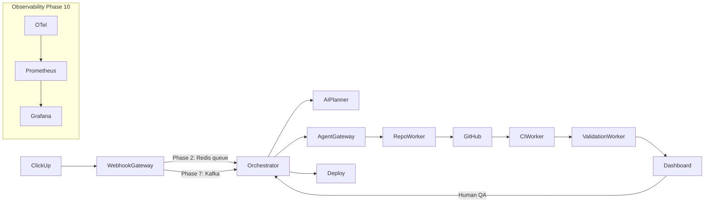
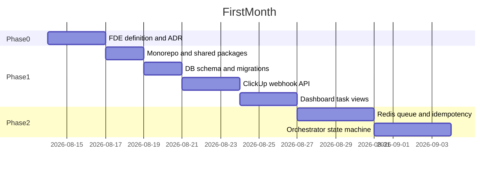

# AI Dev Orchestrator — Full Implementation Plan

## Current State

The repo is a **well-documented scaffold** with no application code yet:

- **Done:** [README.md](README.md), [docs/architecture/README.md](docs/architecture/README.md), 28 component READMEs, [docker-compose.yml](docker-compose.yml) (PostgreSQL + Redis), [.env.example](.env.example)
- **Not started:** No `package.json`, migrations, source files, tests, CI, or Terraform
- **Runnable today:** `docker compose up -d` only

**Immediate gap:** Phase 0 FDE baseline is incomplete ([docs/fde/README.md](docs/fde/README.md) still has placeholders).

---

## Architecture Target



**State machine** (from [docs/architecture/README.md](docs/architecture/README.md)):

```
CREATED → PARSING → PLANNING → EXECUTING → PR_CREATED → CI_RUNNING
  → VALIDATING → WAITING_FOR_QA → APPROVED → MERGED → DEPLOYED
```

---

## Phase 0 — FDE Orientation (Week 0, ~3 days)

**Milestone:** Explain FDE and project success criteria in writing.

| Deliverable | Location |
|-------------|----------|
| One-page FDE definition | [docs/fde/README.md](docs/fde/README.md) |
| System context diagram | [docs/architecture/README.md](docs/architecture/README.md) |
| First ADR: monorepo structure | [docs/adr/001-monorepo-structure.md](docs/adr/001-monorepo-structure.md) |
| First interview card (FDE concept) | `docs/interview/fde-definition.md` |

**Key decisions to document:**
- Monorepo with `apps/`, `services/`, `packages/` (already chosen — write ADR)
- Local-first cost strategy ($0 dev stack)
- TypeScript for orchestration layer; Python for AI; Go for workers

---

## Phase 1 — Node.js + PostgreSQL (Weeks 1–2)

**Milestone:** ClickUp task appears in the platform (webhook → DB → dashboard).

### 1.1 Monorepo foundation

Initialize at repo root:

```
package.json          # npm workspaces: apps/*, packages/*, services/orchestrator
tsconfig.base.json
turbo.json            # optional but recommended for build orchestration
```

Create shared packages first:
- [packages/types/](packages/types/) — `Task`, `Organization`, `Repository`, `TaskStatus` enum, webhook payload types
- [packages/config/](packages/config/) — env validation with `zod`, load from `.env`
- [packages/clients/](packages/clients/) — ClickUp API client (fetch task details after webhook)

### 1.2 Database schema

Add migration tool (recommend **Drizzle ORM** or **Prisma**) in `apps/api`:

```sql
-- Core entities from architecture doc
organizations (id, name, clickup_workspace_id, created_at)
repositories    (id, org_id, github_owner, github_repo, default_branch)
tasks           (id, org_id, clickup_task_id, title, description, status, raw_payload, created_at)
events          (id, task_id, type, payload, created_at)  -- audit log
```

Run migrations against `docker compose` PostgreSQL.

### 1.3 API app — [apps/api/](apps/api/)

Stack: **Express + TypeScript + Drizzle/Prisma**

| Endpoint | Purpose |
|----------|---------|
| `POST /webhooks/clickup` | Verify signature, parse payload, upsert task, log event |
| `GET /api/tasks` | List tasks (paginated) |
| `GET /api/tasks/:id` | Task detail + event history |
| `GET /health` | Liveness check |

Webhook flow:
1. Validate `CLICKUP_WEBHOOK_SECRET` signature
2. Extract `task_id`, `event` type from payload
3. Fetch full task from ClickUp API (`CLICKUP_API_TOKEN`)
4. Upsert into `tasks` table with status `CREATED`
5. Insert row into `events`

### 1.4 Dashboard — [apps/dashboard/](apps/dashboard/)

Stack: **Next.js 14 App Router + Tailwind**

| Page | Purpose |
|------|---------|
| `/tasks` | Table: title, status, created_at, ClickUp link |
| `/tasks/[id]` | Detail view: description, raw payload, event timeline |
| `/` | Redirect to `/tasks` |

Fetch from `apps/api` REST endpoints. No auth yet (Phase 11).

### 1.5 Verification

- Register ClickUp webhook pointing to `ngrok` → local API
- Create/update a ClickUp task → appears in dashboard within seconds
- Write interview card: PostgreSQL + webhooks

**Break-it Wednesday:** Send malformed payloads, duplicate webhooks, DB down — observe behavior (no idempotency yet; that's Phase 2).

---

## Phase 2 — Redis + State Machines (Weeks 3–4)

**Milestone:** Duplicate webhooks don't corrupt state.

### Deliverables

| Component | Work |
|-----------|------|
| [services/orchestrator/](services/orchestrator/) | Extract workflow engine from API; state machine library (e.g. XState or hand-rolled) |
| Redis | Job queue (BullMQ), idempotency keys (`webhook:{event_id}`), distributed locks |
| [apps/api/](apps/api/) | Webhook handler enqueues job instead of writing directly |
| State transitions | `CREATED → PARSING` on enqueue; guard invalid transitions |

**Idempotency pattern:**
```
SET webhook:{clickup_event_id} NX EX 86400
→ if exists: return 200 (already processed)
→ else: enqueue + process
```

**Break-it Wednesday:** Fire 10 duplicate webhooks concurrently — verify exactly one task row, one state transition.

**ADR:** [docs/adr/002-redis-idempotency.md](docs/adr/002-redis-idempotency.md)

---

## Phase 3 — Python AI Planner (Weeks 5–6)

**Milestone:** Raw ticket → structured implementation plan.

### [services/ai-planner/](services/ai-planner/)

Stack: **FastAPI + Pydantic + OpenAI structured outputs**

| Endpoint | Input | Output |
|----------|-------|--------|
| `POST /parse-task` | Raw ClickUp task JSON | Structured requirements, acceptance criteria |
| `POST /generate-plan` | Parsed requirements + repo context | Step-by-step implementation plan |
| `GET /health` | — | Liveness |

Orchestrator calls planner after `CREATED → PARSING → PLANNING`.

Store plan JSON in `tasks.implementation_plan` column (migration).

**Break-it Wednesday:** Empty description, 10k-token ticket, LLM timeout — verify graceful `FAILED` state.

**Cost note:** Start with `gpt-4o-mini`; log token usage per call.

---

## Phase 4 — Agent Gateway + Cost Governance (Weeks 7–8)

**Milestone:** Switch agent providers without workflow changes.

### [agents/](agents/)

Define shared interface in [packages/types/](packages/types/) or `agents/shared/`:

```typescript
interface AgentProvider {
  execute(plan: ImplementationPlan, repo: Repository): Promise<AgentResult>
  estimateCost(plan: ImplementationPlan): number
}
```

Implement adapters:
- [agents/local/](agents/local/) — stub/mock for $0 dev
- [agents/openai/](agents/openai/) — OpenAI API agent
- [agents/cursor/](agents/cursor/) — Cursor-compatible adapter

**Budget manager** in orchestrator:
- Enforce `AI_MAX_COST_PER_TASK_USD`, `AI_DAILY_BUDGET_USD`, `AI_MAX_AGENT_STEPS` from [.env.example](.env.example)
- Track spend in Redis + PostgreSQL `ai_usage` table
- Transition to `FAILED` when budget exceeded

**Break-it Wednesday:** Set budget to $0.01, run expensive task — verify hard stop.

---

## Phase 5 — GitHub Automation + CI/CD (Weeks 9–10)

**Milestone:** ClickUp task produces a real PR.

### Components

| Component | Work |
|-----------|------|
| [services/repo-worker/](services/repo-worker/) | Initial Node.js version (Go rewrite in Phase 6); GitHub App auth; branch + commit + PR |
| [services/ci-worker/](services/ci-worker/) | Poll GitHub Actions status; update task state |
| [services/validation-worker/](services/validation-worker/) | Stub acceptance check |
| [packages/clients/](packages/clients/) | GitHub App client |
| GitHub Actions | `.github/workflows/ci.yml` in this repo + template for target repos |
| Dashboard | QA approval UI (`WAITING_FOR_QA → APPROVED/REJECTED`) |

**End-to-end flow:**
```
ClickUp ticket → plan → agent edits code → PR opened → CI runs
→ VALIDATING → WAITING_FOR_QA (dashboard) → APPROVED
```

**Break-it Wednesday:** Invalid repo, expired GitHub token, CI failure — verify `FAILED` + error surfaced in dashboard.

**First real demo:** Record a 2-min Loom of ClickUp → PR pipeline.

---

## Phase 6 — Go + gRPC Workers (Weeks 11–12)

**Milestone:** Two services communicate via gRPC.

### [proto/](proto/)

Define contracts:
- `repoworker.proto` — `CreateBranch`, `ApplyChanges`, `CreatePR`
- `ciworker.proto` — `TriggerCI`, `GetStatus`

Rewrite [services/repo-worker/](services/repo-worker/) and [services/ci-worker/](services/ci-worker/) in Go.

Orchestrator calls workers via gRPC (grpc-js client).

**Break-it Wednesday:** Kill repo-worker mid-request — verify timeout + retry + `FAILED` state.

---

## Phase 7 — Kafka Event-Driven Architecture (Weeks 13–14)

**Milestone:** Workflow decoupled through Kafka with replay.

### Changes

- Uncomment Kafka in [docker-compose.yml](docker-compose.yml)
- [packages/events/](packages/events/) — Avro/JSON schemas for topics listed in architecture doc
- Replace Redis pub/sub (keep Redis for idempotency/caching) with Kafka producers/consumers
- Orchestrator consumes `task.created`; workers consume domain events
- Add replay script: re-process from offset

**Topics:** `task.created`, `task.updated`, `agent.started/completed/failed`, `pr.created`, `ci.started/completed/failed`

**Break-it Wednesday:** Stop Kafka broker mid-flow — verify consumer recovery and no duplicate PRs.

---

## Phase 8 — AWS + Terraform (Weeks 15–16)

**Milestone:** Infrastructure recreated from Terraform.

### [infrastructure/terraform/](infrastructure/terraform/)

Modules:
- VPC, RDS (PostgreSQL), ElastiCache (Redis), MSK (Kafka) or self-managed
- ECS Fargate or EC2 for services
- Secrets Manager for API keys
- S3 for Terraform state

Environments: `dev`, `staging` (no prod until Phase 11 security).

**Cost control:** `terraform destroy` when not in use; use Free Tier where possible.

---

## Phase 9 — Kubernetes (Weeks 17–18)

**Milestone:** Services deploy and recover via K8s.

### [infrastructure/kubernetes/](infrastructure/kubernetes/)

- kind cluster for local dev
- Deployments + Services for api, orchestrator, ai-planner, workers
- ConfigMaps/Secrets from `.env` pattern
- Liveness/readiness probes
- HPA for api and workers

**Break-it Wednesday:** `kubectl delete pod` — verify auto-recovery.

---

## Phase 10 — Observability + SRE (Weeks 19–20)

**Milestone:** Diagnose failures from telemetry.

### [observability/](observability/)

- OpenTelemetry SDK in all services (traces + metrics + structured logs)
- Uncomment Prometheus + Grafana in docker-compose
- Dashboards: task throughput, failure rate, p95 latency, AI cost per task
- Alert rules: error rate > 5%, queue depth > 100

**Exercise:** Inject a failure, trace it ClickUp → PR using Grafana Tempo/Jaeger.

Write first incident postmortem: [docs/incidents/001-ci-failure-rca.md](docs/incidents/001-ci-failure-rca.md)

---

## Phase 11 — Security + Multi-Tenancy (Weeks 21–22)

**Milestone:** Tenant isolation enforced.

- OAuth/OIDC login (GitHub or Auth0)
- RBAC: org admin, developer, QA approver
- Row-level tenant isolation on all DB queries
- Secrets in AWS Secrets Manager / K8s Secrets
- Audit log for all state transitions and approvals
- TLS everywhere; webhook signature verification hardened

**Break-it Wednesday:** Attempt cross-tenant task access — must return 403.

---

## Phase 12 — Advanced Distributed Systems (Weeks 23–24)

**Milestone:** Five failure modes documented.

Document and demonstrate:
1. Split-brain during orchestrator failover
2. Kafka consumer lag under load
3. GitHub API rate limiting
4. LLM timeout mid-agent-run
5. Database connection pool exhaustion

Each gets: failure injection steps, observed behavior, mitigation, ADR.

---

## Phase 13 — Data Engineering + Analytics (Weeks 25–26)

**Milestone:** Real-time engineering analytics dashboard.

### [services/analytics-worker/](services/analytics-worker/)

- Kafka consumer → aggregate metrics (task duration, retry rate, AI cost, PR success rate)
- Store in PostgreSQL analytics tables or ClickHouse (optional)
- Dashboard panel in Grafana + `/analytics` page in Next.js

Optional: Apache Flink for windowed aggregations (commented profile in docker-compose).

---

## Phase 14 — Legacy Modernization (Weeks 27–28)

**Milestone:** Messy repo → prioritized modernization plan.

- Point orchestrator at a deliberately messy open-source repo
- AI planner generates modernization plan (deps upgrade, test coverage, architecture)
- Execute highest-priority item via agent → PR
- Write case study

---

## Phase 15 — Chaos Engineering (Week 29)

**Milestone:** Resilience report with measurements.

- Use chaos tools (litmus, manual fault injection) on K8s cluster
- Measure: MTTR, error budget burn, recovery time after Kafka/DB/API failures
- Publish resilience report in [docs/case-studies/](docs/case-studies/)

---

## Phase 16 — FDE Portfolio (Week 30)

**Milestone:** 2–3 public case studies.

| Deliverable | Location |
|-------------|----------|
| Architecture diagrams (all 5 from architecture doc) | [docs/architecture/](docs/architecture/) |
| 2–3 case studies | [docs/case-studies/](docs/case-studies/) |
| Demo video | README embed |
| Interview cards (10+) | [docs/interview/](docs/interview/) |
| Public repo polished | [README.md](README.md) success criteria all checked |

---

## Weekly Operating System (Every Phase)

Follow the cadence from [README.md](README.md):

| Day | Activity |
|-----|----------|
| Monday | Learn concept (use resources in [docs/fde/README.md](docs/fde/README.md)) |
| Tuesday | Ship smallest useful version |
| Wednesday | Break it deliberately |
| Thursday | Harden: tests, docs, ADR |
| Friday | Interview card + 30–60s spoken answer |
| Weekend | Demo, README update, push to GitHub |

---

## Recommended Build Order (First 4 Weeks)



---

## Key Technical Choices (Recommendations)

| Decision | Recommendation | Rationale |
|----------|----------------|-----------|
| Monorepo tool | npm workspaces + Turborepo | Matches TS-heavy stack; simple start |
| ORM | Drizzle ORM | Lightweight, great TS inference, easy migrations |
| Queue | BullMQ (Redis) | Phase 2; migrate to Kafka in Phase 7 |
| State machine | XState in orchestrator | Visualizable, testable transitions |
| API framework | Express (Phase 1) → consider Fastify later | Familiar, fast to ship |
| Agent dev | `agents/local` stub first | $0 cost while building pipeline |
| IaC | Terraform over CDK | Industry standard, great for FDE interviews |

---

## Risk Mitigation

- **Scope creep:** Each phase has one measurable milestone — do not start Phase N+1 until milestone N demo works
- **AI cost:** Use local stub agent until Phase 5; then `gpt-4o-mini` with hard budgets
- **Cloud cost:** Local kind + docker-compose until Phase 8; destroy AWS resources nightly
- **Complexity:** Keep repo-worker in Node.js through Phase 5; rewrite Go only in Phase 6

---

## Success Criteria Mapping

By Phase 16, every checkbox in [README.md](README.md) lines 155–165 should be demonstrable with a concrete artifact (code, ADR, case study, or interview card).
