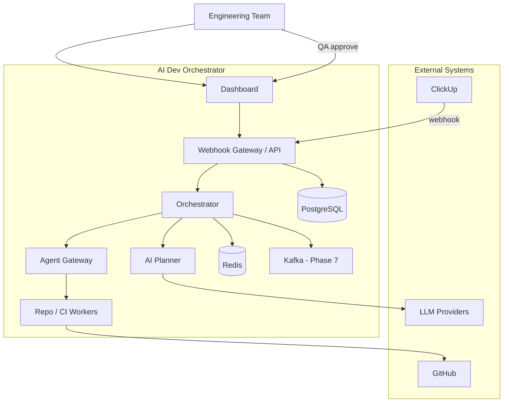

# Architecture

## System Overview

The AI Dev Orchestrator converts ClickUp engineering tickets into validated software changes across one or more repositories.

## Core Components

| Component | Location | Responsibility |
|-----------|----------|----------------|
| Webhook Gateway | `apps/api` | Auth, validation, idempotency, event publishing |
| Dashboard | `apps/dashboard` | Task inspection, QA approval, observability views |
| Orchestrator | `services/orchestrator` | State machine, job scheduling, workflow coordination |
| AI Planner | `services/ai-planner` | Task parsing, plan generation, failure analysis |
| Repo Worker | `services/repo-worker` | Branch creation, code changes, PR creation |
| CI Worker | `services/ci-worker` | CI/CD pipeline orchestration |
| Validation Worker | `services/validation-worker` | Acceptance criteria validation |
| Analytics Worker | `services/analytics-worker` | Stream processing and metrics |
| Agent Gateway | `agents/` | Provider abstraction (Cursor, OpenAI, local) |

## Task Lifecycle State Machine

```
CREATED → PARSING → PLANNING → EXECUTING → PR_CREATED → CI_RUNNING
  → VALIDATING → WAITING_FOR_QA → APPROVED → MERGED → DEPLOYED
```

Terminal / recovery states: `FAILED`, `REJECTED`, `CANCELLED`

## Event Topics (Phase 7+)

- `task.created`, `task.updated`
- `agent.started`, `agent.completed`, `agent.failed`
- `pr.created`
- `ci.started`, `ci.completed`, `ci.failed`
- `deployment.started`, `deployment.completed`

## Data Model (Phase 1+)

Core entities: `organizations`, `users`, `repositories`, `tasks`, `acceptance_criteria`, `events`, `workflow_runs`

## Diagrams

### System Context Diagram (Phase 0)



### Phase 1 Data Flow (Implemented)

```
ClickUp webhook → POST /webhooks/clickup → verify signature
  → fetch task from ClickUp API → upsert tasks table → insert events row
  → Dashboard polls GET /api/tasks → displays task list + event timeline
```

### Remaining diagrams (future phases)

- [ ] Container diagram (detailed)
- [ ] Sequence diagram: ClickUp → PR
- [ ] Sequence diagram: CI failure → RCA
- [ ] Deployment diagram (AWS / K8s)
